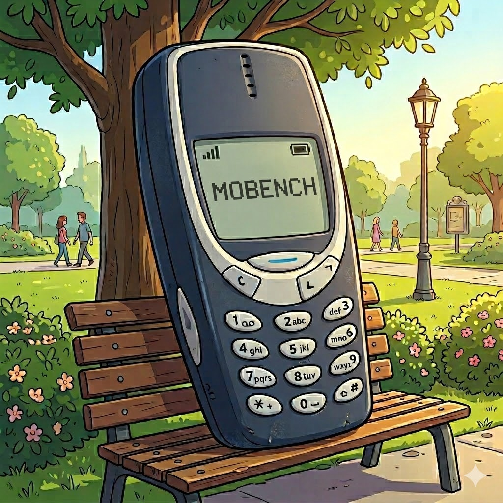
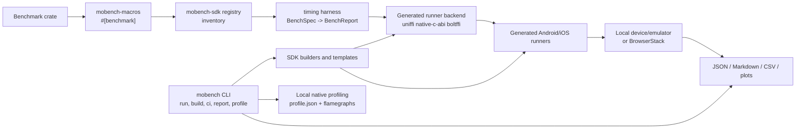
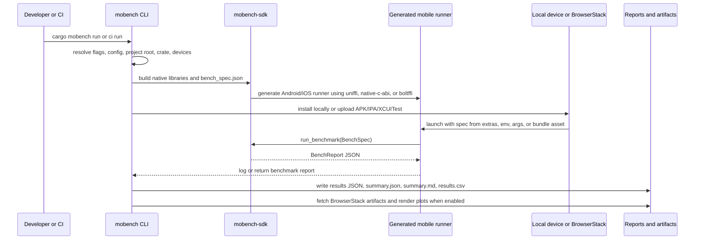
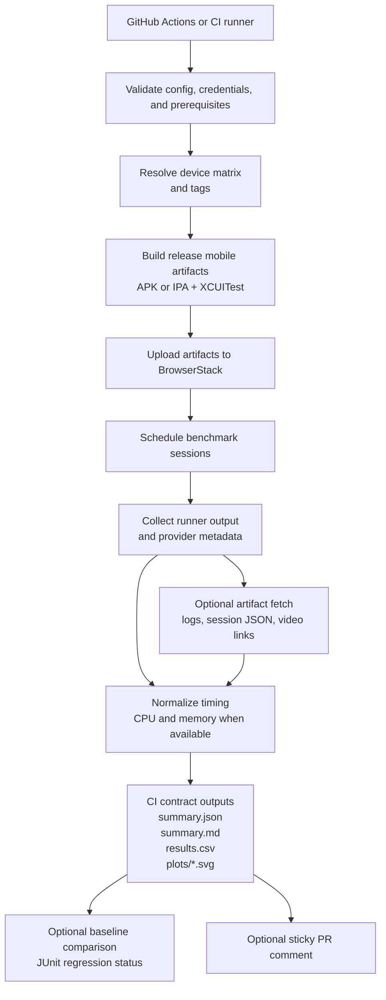
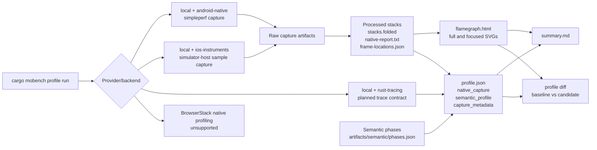
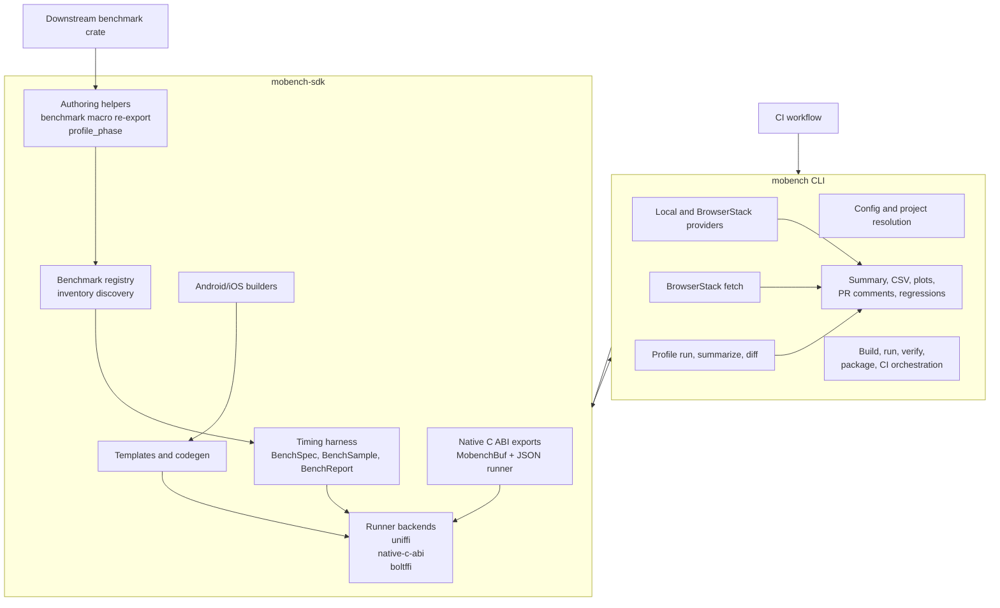

<p align="center">
  
</p>

# mobench

mobench is a Rust mobile benchmarking toolkit. It builds and runs Rust
benchmarks on Android and iOS, locally or on BrowserStack, with a
library-first SDK, a `cargo mobench` CLI, config-first project resolution,
stable CI output contracts, and local native profiling artifacts.

Current workspace release and crates.io line: **v0.1.43**.

## What It Provides

- `#[benchmark]` for registering Rust functions through `inventory`.
- `mobench-sdk` timing, registry, runner, mobile builders, and generated runner
  templates.
- `mobench` CLI orchestration for build, run, CI, reporting, BrowserStack,
  device resolution, and local native profiling.
- Three generated mobile runner backends:
  - `uniffi` (default): generated Kotlin/Swift bindings for compatibility.
  - `native-c-abi`: direct mobench JSON C ABI for engine benchmarks where FFI
    binding overhead should stay out of measured timing and memory.
  - `boltffi`: generated Kotlin/Swift bindings through BoltFFI.
- Stable machine-readable artifacts: JSON summaries, Markdown summaries, CSV
  rows, optional plot SVGs, profiling manifests, trace-event JSON, and native
  flamegraph bundles.
- Programmatic CLI integration types in the `mobench` crate:
  `RunRequest`, `RunResult`, `DeviceSelection`, and `Report`.

## Why It Exists

Rust performance work often stops at host benchmarks, while production code
runs through mobile FFI, mobile schedulers, mobile memory limits, and real
device thermal behavior. mobench keeps benchmark definitions in Rust, generates
mobile harnesses, runs locally or on BrowserStack, and writes stable artifacts
that CI systems and humans can compare.

## How It Works

1. A benchmark crate marks functions with `#[benchmark]`.
2. The macro registers functions at compile time through `inventory`.
3. The CLI resolves the benchmark crate from flags, `mobench.toml`, Cargo
   metadata, git root, or the legacy `bench-mobile/` layout.
4. The SDK builders compile native libraries and generate Android/iOS runners.
5. Generated runners call either the UniFFI surface or the direct native C ABI.
6. The CLI collects local or BrowserStack results and renders reports.
7. Optional local profile sessions capture `simpleperf` or simulator-host
   `sample` stacks and produce flamegraph artifacts.

## Workflow Diagrams

Mermaid sources live in `docs/diagrams/` and are mirrored here.

### Crate Architecture



### Benchmark Lifecycle



### BrowserStack CI Lifecycle



### Profiling Artifact Lifecycle



### SDK Versus CLI Responsibilities


## Workspace Crates

- `crates/mobench` ([mobench](https://crates.io/crates/mobench)): CLI tool for
  setup, build, run, fetch, CI, report, devices, fixture, and profile commands.
- `crates/mobench-sdk` ([mobench-sdk](https://crates.io/crates/mobench-sdk)):
  core SDK timing harness, registry, runner, builders, generated runner
  templates, UniFFI support, and native C ABI export support.
- `crates/mobench-macros`
  ([mobench-macros](https://crates.io/crates/mobench-macros)): `#[benchmark]`
  proc macro with setup, teardown, and per-iteration support.
- `crates/sample-fns`: repository demo benchmarks and generated mobile bindings.
- `examples/basic-benchmark`: minimal SDK integration example.
- `examples/ffi-benchmark`: full FFI example with generated mobile runners.

## Quick Start

```bash
# Install CLI
cargo binstall mobench

# Or build from source
cargo install mobench

# Add SDK to a benchmark crate
cargo add mobench-sdk inventory

# Check prerequisites and config
cargo mobench doctor --target both
cargo mobench config validate --config bench-config.toml
cargo mobench check --target android
cargo mobench check --target ios

# Build artifacts under target/mobench/
cargo mobench build --target android
cargo mobench build --target ios
cargo mobench build --target android --progress

# Run a host-only CI-compatible smoke run
cargo mobench run --target android --function sample_fns::fibonacci --local-only

# Run on BrowserStack. Use --release for smaller uploads.
cargo mobench run \
  --target android \
  --function sample_fns::fibonacci \
  --devices "Google Pixel 7-13.0" \
  --release

# Resolve BrowserStack devices from a matrix/profile
cargo mobench devices --platform android
cargo mobench devices resolve \
  --platform android \
  --profile default \
  --device-matrix device-matrix.yaml

# CI contract outputs
cargo mobench ci run \
  --target android \
  --function sample_fns::fibonacci \
  --local-only \
  --plots auto

# Reporting helpers
cargo mobench summary target/mobench/results.json
cargo mobench report summarize \
  --summary target/mobench/ci/summary.json \
  --plots auto
cargo mobench report github \
  --pr 123 \
  --summary target/mobench/ci/summary.json

# Local native profiling
cargo mobench profile run \
  --target android \
  --function sample_fns::fibonacci \
  --provider local \
  --backend android-native \
  --trace-events-output target/mobench/profile/trace-events.json
cargo mobench profile summarize --profile target/mobench/profile/profile.json
cargo mobench profile diff \
  --baseline target/mobench/profile/android-sample_fns--fibonacci/profile.json \
  --candidate target/mobench/profile/profile.json \
  --normalize
```

## Benchmark API

```rust
use mobench_sdk::benchmark;

#[benchmark]
pub fn fibonacci_30() {
    let result = fibonacci(30);
    std::hint::black_box(result);
}

fn fibonacci(n: u32) -> u64 {
    match n {
        0 => 0,
        1 => 1,
        _ => fibonacci(n - 1) + fibonacci(n - 2),
    }
}
```

For expensive setup that should not be timed:

```rust
use mobench_sdk::benchmark;

fn setup_proof() -> ProofInput {
    generate_complex_proof()
}

#[benchmark(setup = setup_proof)]
pub fn verify_proof(input: &ProofInput) {
    verify(&input.proof);
}
```

For mutable input that needs a fresh value per iteration:

```rust
use mobench_sdk::benchmark;

fn generate_vec() -> Vec<i32> {
    (0..1000).rev().collect()
}

#[benchmark(setup = generate_vec, per_iteration)]
pub fn sort_benchmark(mut data: Vec<i32>) {
    data.sort();
    std::hint::black_box(data);
}
```

## Generated Runner Backends

`mobench.toml` controls generated mobile runner behavior:

```toml
[project]
crate = "zk-mobile-bench"
library_name = "zk_mobile_bench"
ffi_backend = "uniffi" # default; also supports "native-c-abi" and "boltffi"

[android]
package = "com.example.bench"
min_sdk = 24

[ios]
bundle_id = "com.example.bench"
deployment_target = "15.0"
# runner = "swiftui" # or "uikit-legacy" for legacy iOS targets

[benchmarks]
default_function = "my_crate::my_benchmark"
default_iterations = 100
default_warmup = 10
```

Use `ffi_backend = "uniffi"` when you want the historical generated Kotlin and
Swift binding path. Use `ffi_backend = "native-c-abi"` when the generated app
should call mobench direct JSON C ABI and avoid UniFFI binding-generation
overhead in the measured path. Use `ffi_backend = "boltffi"` when generated
runners should call BoltFFI-generated Kotlin/Swift bindings.

iOS deployment targets below 15.0 select the UIKit legacy runner by default.
Forcing `runner = "swiftui"` below 15.0 fails early. Legacy BrowserStack
targets such as iPhone 7 on iOS 10 also require an older Xcode lane capable of
building for that OS.

Native C ABI benchmark crates export the ABI once from the crate root:

```rust
mobench_sdk::export_native_c_abi!();
```

The export provides:

- `mobench_run_benchmark_json`
- `mobench_free_buf`
- `mobench_last_error_message`
- `MobenchBuf`

BoltFFI benchmark crates export a JSON entrypoint:

```rust
#[boltffi::export]
pub fn run_benchmark_json(spec_json: &str) -> Result<String, String> {
    // Call your mobench runner and return serialized report JSON.
}
```

## CI Outputs

`cargo mobench ci run` writes stable contract files to `target/mobench/ci/` by
default:

- `summary.json`
- `summary.md`
- `results.csv`
- `plots/*.svg` when local plot rendering is enabled

Summary resource fields include `cpu_total_ms`, `cpu_median_ms`, and
`peak_memory_kb`. Missing resource metrics are emitted as blank CSV fields.

## Profiling Outputs

Profiling is local-first in this release. BrowserStack native profiling is
explicitly unsupported; normal BrowserStack benchmark runs still report timing,
CPU, and memory metrics when available.

| Provider | Backend | Current behavior |
| --- | --- | --- |
| `local` | `android-native` | Attempts real `simpleperf` capture, symbolization, folded stacks, native report, SVGs, and `flamegraph.html`. |
| `local` | `ios-instruments` | Attempts simulator-host `sample` capture, folded stacks, native report, SVGs, and `flamegraph.html`. |
| `local` | `rust-tracing` | Planned manifest/trace contract only. |
| `browserstack` | `android-native` / `ios-instruments` / `rust-tracing` | Unsupported for native profile capture in this release. |

Each profile session writes:

- `target/mobench/profile/<run-id>/profile.json`
- `target/mobench/profile/<run-id>/summary.md`
- `artifacts/processed/stacks.folded`
- `artifacts/processed/native-report.txt`
- `artifacts/processed/flamegraph.html`
- `artifacts/semantic/phases.json` when benchmarks emit
  `mobench_sdk::timing::profile_phase(...)`

The CLI also refreshes convenience copies at
`target/mobench/profile/profile.json` and `target/mobench/profile/summary.md`.

## Configuration Resolution

Resolution precedence is:

1. Explicit CLI flags: `--project-root`, `--crate-path`
2. Explicit `--config`
3. Discovered `mobench.toml`
4. Cargo workspace metadata
5. Git root
6. Legacy `bench-mobile/` fallback

CLI flags override config file values. In `cargo mobench run --config <FILE>`
mode, `--device-matrix <FILE>` overrides `device_matrix` from the config file.

## Project Docs

- `docs/guides/README.md`: guide index.
- `docs/guides/sdk-integration.md`: SDK integration.
- `docs/guides/build.md`: build prerequisites and troubleshooting.
- `docs/guides/profiling.md`: local native profiling guide.
- `docs/guides/testing.md`: host, device, and workflow testing.
- `docs/guides/browserstack-ci.md`: BrowserStack benchmark CI.
- `docs/guides/browserstack-metrics.md`: BrowserStack metric normalization.
- `docs/guides/fetch-results.md`: fetching and summarizing remote results.
- `docs/guides/release.md`: publish checklist.
- `docs/codebase/README.md`: codebase reference map.
- `docs/codebase/PUBLIC_API.md`: public API and semver boundaries.
- `docs/schemas/`: machine-readable CI, summary, and trace-event schemas.
- `docs/diagrams/`: Mermaid source diagrams mirrored in this README.
- `RELEASE_NOTES.md`: release history and support status.

## License

MIT licensed, World Foundation 2026.
