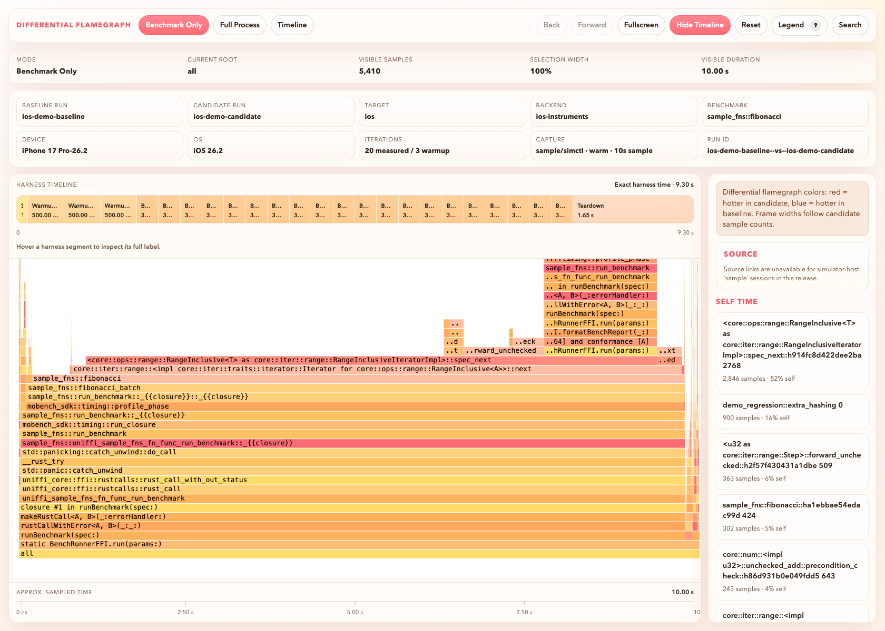
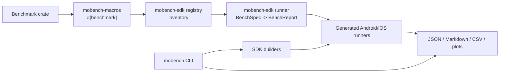
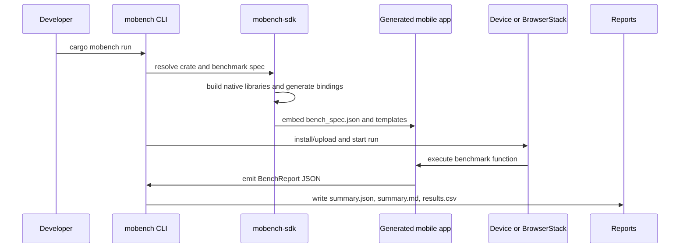
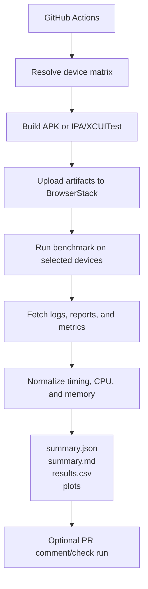
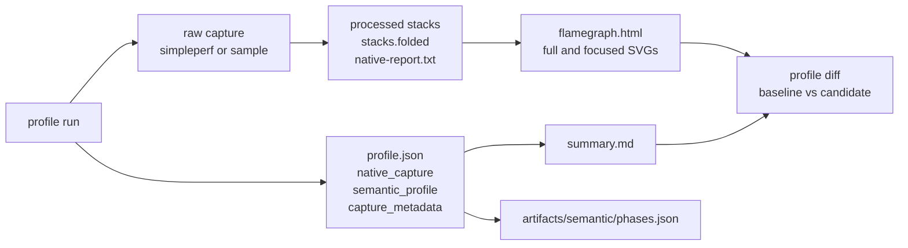
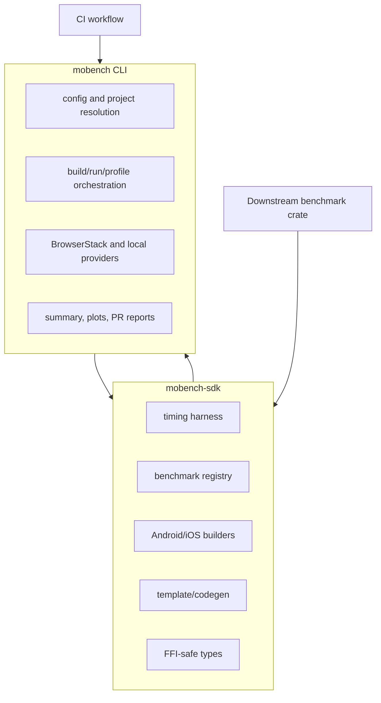

<p align="center">
  
</p>

# mobench

Mobile benchmarking toolkit for Rust. Build and run Rust benchmarks on Android and iOS, locally or on BrowserStack, with a library-first workflow, config-first project resolution, and local native profiling that produces interactive flamegraph artifacts.

## What it is

mobench provides a Rust API and a CLI for running benchmarks on real mobile devices. You define benchmarks in Rust, generate mobile bindings automatically, and drive execution from the CLI with consistent output formats (JSON, Markdown, CSV).

For programmatic CI integrations, `mobench` exposes typed request/result types (`RunRequest`, `RunResult`, `DeviceSelection`, `Report`) via the crate API.

## Why mobench exists

Rust performance work often stops at host benchmarks even when production code
runs through mobile FFI, mobile schedulers, mobile memory limits, and real device
thermal behavior. mobench keeps the benchmark definition in Rust, generates the
mobile harness, runs it locally or on BrowserStack, and writes stable artifacts
that CI and humans can compare.

## How mobench works

- `#[benchmark]` marks functions and registers them via `inventory`
- `mobench-sdk` builds mobile artifacts, provides the timing harness, and generates app templates from embedded assets
- UniFFI proc macros generate Kotlin and Swift bindings directly from Rust types
- The CLI writes a benchmark spec (function, iterations, warmup) and packages it into the app
- Mobile apps call `run_benchmark` via the generated bindings and return timing samples
- The CLI collects results locally or from BrowserStack and writes summaries

## Workspace crates

- `crates/mobench` ([mobench](https://crates.io/crates/mobench)): CLI tool that builds, runs, and fetches benchmarks
- `crates/mobench-sdk` ([mobench-sdk](https://crates.io/crates/mobench-sdk)): core SDK with timing harness, builders, registry, and codegen
- `crates/mobench-macros` ([mobench-macros](https://crates.io/crates/mobench-macros)): `#[benchmark]` proc macro
- `crates/sample-fns`: sample benchmarks and UniFFI bindings
- `examples/basic-benchmark`: minimal SDK integration example with a local README
- `examples/ffi-benchmark`: full UniFFI/FFI surface example with a local README

## Quick start

```bash
# Install the CLI (fast)
cargo binstall mobench

# Or build from source
cargo install mobench

# Add the SDK to your project
cargo add mobench-sdk inventory

# Check prerequisites before building
cargo mobench doctor --target both
cargo mobench config validate --config bench-config.toml
cargo mobench check --target android
cargo mobench check --target ios

# Build artifacts (outputs to target/mobench/ by default)
cargo mobench build --target android
cargo mobench build --target ios

# Build with progress output for clearer feedback
cargo mobench build --target android --progress

# Run a benchmark locally
cargo mobench run --target android --function sample_fns::fibonacci

# Run on BrowserStack (use --release for smaller APK uploads)
cargo mobench run --target android --function sample_fns::fibonacci \
  --devices "Google Pixel 7-13.0" --release

# List available BrowserStack devices
cargo mobench devices --platform android

# Resolve matrix devices deterministically for CI
cargo mobench devices resolve --platform android --profile default --device-matrix device-matrix.yaml

# Fixture lifecycle helpers
cargo mobench fixture init
cargo mobench fixture verify
cargo mobench fixture cache-key

# View benchmark results summary
cargo mobench summary target/mobench/results.json

# CI one-command orchestration with stable outputs
cargo mobench ci run --target android --function sample_fns::fibonacci --local-only --plots auto

# Reporting helpers from standardized outputs
cargo mobench report summarize --summary target/mobench/ci/summary.json --plots auto
cargo mobench report github --pr 123 --summary target/mobench/ci/summary.json

# Local native profiling
cargo mobench profile run --target android --function sample_fns::fibonacci \
  --provider local --backend android-native \
  --trace-events-output target/mobench/profile/trace-events.json
cargo mobench profile summarize --profile target/mobench/profile/profile.json
cargo mobench profile diff \
  --baseline target/mobench/profile/android-sample_fns--fibonacci/profile.json \
  --candidate target/mobench/profile/profile.json \
  --normalize
```

CI contract outputs are written to `target/mobench/ci/`:
- `summary.json`
- `summary.md`
- `results.csv`
- `plots/*.svg` when local plot rendering is enabled

Local summary renderers (`ci run --plots ...` and `report summarize --plots ...`) append a `Device Comparison Plots` section with one Sina-style SVG per benchmark function. Summary resource fields use `cpu_total_ms` and `peak_memory_kb`; Android raw resource stats are preserved and iOS peak memory is enriched from BrowserStack app profiling when available.

Profiling commands are local-first in this release. Each session
writes its current manifest and summary under
`target/mobench/profile/<run-id>/`, and the CLI also refreshes top-level
`target/mobench/profile/profile.json` and `summary.md` as convenience copies of
the latest run. Differential comparisons write to
`target/mobench/profile/diff/<baseline-run-id>--vs--<candidate-run-id>/` and
refresh top-level `profile-diff.json` / `summary.md` under the diff root.
Use `--trace-events-output <path>` when a downstream consumer needs stable
machine-readable harness event JSON; dry runs still write an empty trace
contract so CI can validate the integration path without native profilers.

The manifest is split into three explicit sections:

- `native_capture`: native stack artifacts, symbolization state, and viewer hints
- `semantic_profile`: optional benchmark phase data such as `prove` and `serialize`
- `capture_metadata`: device resolution, capture settings, and warnings

Android-native sessions also emit `artifacts/processed/frame-locations.json`
when `llvm-addr2line` can recover file/line metadata. The interactive viewer
uses that sidecar to surface source links for selected frames and hot-path
entries. iOS simulator-host `sample` sessions do not expose source links in the
current release.

The summary renderer keeps native and semantic outputs separate so the
interactive flamegraph viewer stays focused on native stacks while phase
timings remain readable as benchmark metadata.

When a benchmark uses `mobench_sdk::timing::profile_phase(...)`, local profile
runs also persist a run-scoped semantic sidecar at
`artifacts/semantic/phases.json`. The profile summary renders those phase totals
separately from the flamegraph so phase timing does not get mislabeled as native
stack data.

Profiling capability matrix:

| Provider | Backend | Current behavior | Notes |
|----------|---------|------------------|-------|
| `local` | `android-native` | Attempts real native capture | Uses `simpleperf`, symbolized `stacks.folded`, `native-report.txt`, `flamegraph.html`, and semantic phase summaries when the benchmark emits `profile_phase` data and an `adb` device is available |
| `local` | `ios-instruments` | Attempts real native capture | Uses a simulator-host `sample` capture to write `sample.txt`, `stacks.folded`, `native-report.txt`, and `flamegraph.html`. Semantic phase summaries are merged when the benchmark JSON includes `phases`. |
| `local` | `rust-tracing` | Planned manifest only | Structured trace output is local-only and still not implemented |
| `browserstack` | `android-native` | Unsupported | Use `--provider local` for planning/local capture, or a normal BrowserStack benchmark for timing/memory metrics |
| `browserstack` | `ios-instruments` | Unsupported | Use `--provider local` for simulator-host `sample` capture and flamegraphs. BrowserStack does not provide retrievable native iOS profile artifacts in this release. |
| `browserstack` | `rust-tracing` | Unsupported | Use `--provider local` for trace-events output |

For local native profiling, `profile run` also accepts `--warmup-mode warm|cold`.
Warm mode is the default for local Android/iOS native plans. On Android it performs
one preparatory launch before recording to prime startup caches and reduce first-run
noise. That improves the capture, but it does not remove all per-process bridge
initialization from the recorded run.

For flamegraph regression work, the recommended workflow is:

- archive the per-session `profile.json` plus processed folded stacks as CI artifacts
- fetch a baseline session and a candidate session
- run `cargo mobench profile diff --baseline <profile.json> --candidate <profile.json> --normalize`
- inspect `target/mobench/profile/diff/.../artifacts/processed/flamegraph.html`

The current flamegraph viewer keeps aggregate hotspot analysis and exact harness
timing separate: `Benchmark Only` and `Full Process` stay aggregate flamegraphs,
while `Timeline` exposes exact harness intervals and any recorded chronological
samples without relabeling the aggregate x-axis as wall-clock time.



When you need device-specific planning inputs for profiling, `profile run`
reuses the same resolution model as `devices resolve`:

- `--device "iPhone 14" --os-version 16`
- `--profile high-spec`
- `--profile high-spec --device-matrix device-matrix.yaml`

`summary.md` uses unit-neutral headers (`Mean`, `Median`, `P95`, `Min`, `Max`) and renders the default `CPU` column from measured-iteration `cpu_median_ms` in milliseconds below one second and total seconds otherwise (for example `482ms`, `1.482s`).

`results.csv` includes benchmark-scoped resource columns directly:
- `cpu_total_ms`
- `cpu_median_ms`
- `peak_memory_kb`

Missing resource metrics are emitted as blank CSV fields.

## Configuration

mobench supports a `mobench.toml` configuration file for project settings:

```toml
[project]
crate = "zk-mobile-bench"
library_name = "zk_mobile_bench"

[android]
package = "com.example.bench"
min_sdk = 24

[ios]
bundle_id = "com.example.bench"
deployment_target = "15.0"
# runner = "swiftui"       # or "uikit-legacy" for legacy iOS deployment targets

[benchmarks]
default_function = "my_crate::my_benchmark"
default_iterations = 100
default_warmup = 10
```

Resolution precedence is: explicit CLI flags (`--project-root`, `--crate-path`) → explicit `--config` → discovered `mobench.toml` → Cargo workspace root → git root → legacy `bench-mobile` fallback.

CLI flags override config file values when provided.
- In `cargo mobench run --config <FILE>` mode, `--device-matrix <FILE>` overrides `device_matrix` from the config file.
- iOS deployment targets below 15.0 use the UIKit legacy runner by default; forcing `runner = "swiftui"` below 15.0 fails early. Legacy targets such as iPhone 7 on iOS 10 also require an older Xcode lane capable of building for that OS.
- For regression comparisons, `--baseline` should point to a previous run summary; if it resolves to the same output path, mobench snapshots the prior file before writing the candidate summary.
- In the reusable GitHub workflow, the default baseline source is the latest successful run on the repository default branch when matching artifacts are available.
- `cargo mobench verify --smoke-test` is only supported for benchmark crates linked into the `mobench` CLI binary. External crates discovered through `mobench.toml`, `--project-root`, or `--crate-path` should use `cargo mobench list` and `cargo mobench verify --check-artifacts`.

## Project docs

- `docs/guides/README.md`: guide index for setup, integration, BrowserStack CI, fetch flows, and troubleshooting
- `docs/guides/examples.md`: concrete examples for minimal, setup/teardown, FFI, CI, profiling, and programmatic SDK usage
- `docs/guides/sdk-integration.md`: SDK integration guide
- `docs/guides/build.md`: build prerequisites and troubleshooting
- `docs/guides/profiling.md`: local native profiling guide, artifact layout, and symbol requirements
- `docs/guides/testing.md`: testing guide and device workflows
- `docs/guides/browserstack-ci.md`: BrowserStack benchmark CI setup
- `docs/guides/browserstack-metrics.md`: BrowserStack metric normalization and limits
- `docs/guides/fetch-results.md`: fetching and summarizing results
- `docs/guides/release.md`: preflight and publish checklist
- `docs/codebase/README.md`: current codebase reference map
- `docs/codebase/PUBLIC_API.md`: public API, semver, feature flag, MSRV, and release-readiness boundaries
- `docs/MIGRATION_GUIDE.md`: migration notes for CI and reporting changes
- `docs/specs/dx-improvement-spec.md`: historical DX design spec, kept for context only
- `docs/schemas/`: machine-readable CI/summary schema artifacts
- `RELEASE_NOTES.md`: published release history and support status
- `CLAUDE.md`: developer guide

## Setup and Teardown

For benchmarks that require expensive setup (like generating test data or initializing connections), you can exclude setup time from measurements using the `setup` attribute.

### The Problem

Without setup/teardown, expensive initialization is measured as part of your benchmark:

```rust
#[benchmark]
fn verify_proof() {
    let proof = generate_complex_proof();  // This is measured (bad!)
    verify(&proof);                         // This is what we want to measure
}
```

### The Solution

Use the `setup` attribute to run initialization once before timing begins:

```rust
// Setup function runs once before all iterations (not timed)
fn setup_proof() -> ProofInput {
    generate_complex_proof()  // Takes 5 seconds, but not measured
}

#[benchmark(setup = setup_proof)]
fn verify_proof(input: &ProofInput) {
    verify(&input.proof);  // Only this is measured
}
```

### Per-Iteration Setup

For benchmarks that mutate their input, use `per_iteration` to get fresh data each iteration:

```rust
fn generate_random_vec() -> Vec<i32> {
    (0..1000).map(|_| rand::random()).collect()
}

#[benchmark(setup = generate_random_vec, per_iteration)]
fn sort_benchmark(data: Vec<i32>) {
    let mut data = data;
    data.sort();  // Each iteration gets a fresh unsorted vec
}
```

### Setup with Teardown

For resources that need cleanup (database connections, temp files, etc.):

```rust
fn setup_db() -> Database { Database::connect("test.db") }
fn cleanup_db(db: Database) { db.close(); std::fs::remove_file("test.db").ok(); }

#[benchmark(setup = setup_db, teardown = cleanup_db)]
fn db_query(db: &Database) {
    db.query("SELECT * FROM users");
}
```

### When to Use Each Pattern

| Pattern | Use Case |
|---------|----------|
| `#[benchmark]` | Simple benchmarks with no setup or fast inline setup |
| `#[benchmark(setup = fn)]` | Expensive one-time setup, reused across iterations |
| `#[benchmark(setup = fn, per_iteration)]` | Benchmarks that mutate input, need fresh data each time |
| `#[benchmark(setup = fn, teardown = fn)]` | Resources requiring cleanup (connections, files, etc.) |

## Workflow diagrams

The Mermaid sources live under `docs/diagrams/` so the same diagrams can be
reused in launch posts and landing-page assets.

### Crate architecture



### Benchmark lifecycle



### BrowserStack CI lifecycle



### Profiling artifact lifecycle



### SDK versus CLI responsibilities



## Release Notes

Published release history and support status live in
[`RELEASE_NOTES.md`](RELEASE_NOTES.md). Only the latest release listed there is
treated as supported; earlier crates.io publishes are retained there as
historical test builds and should not be used.

MIT licensed — World Foundation 2026.
