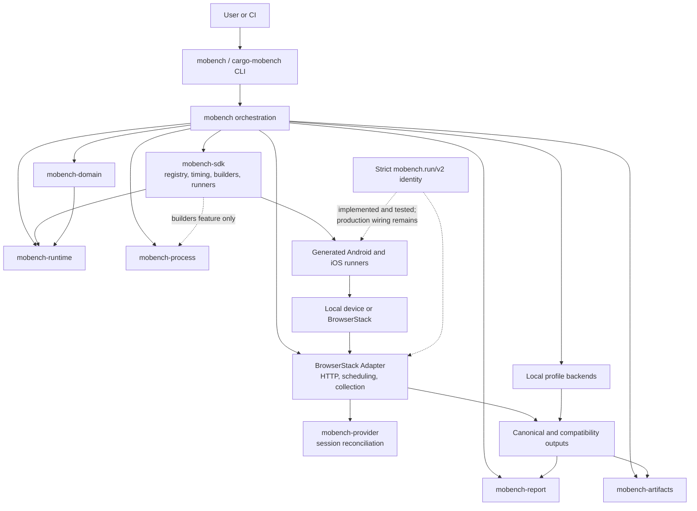
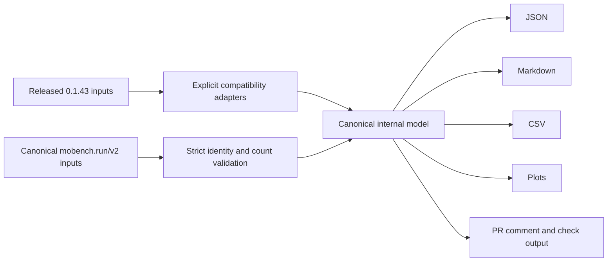
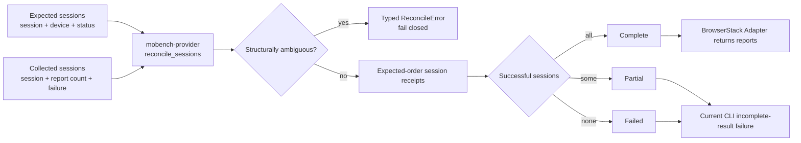
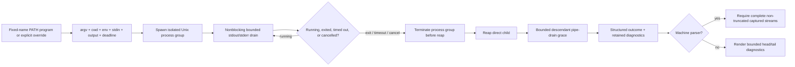
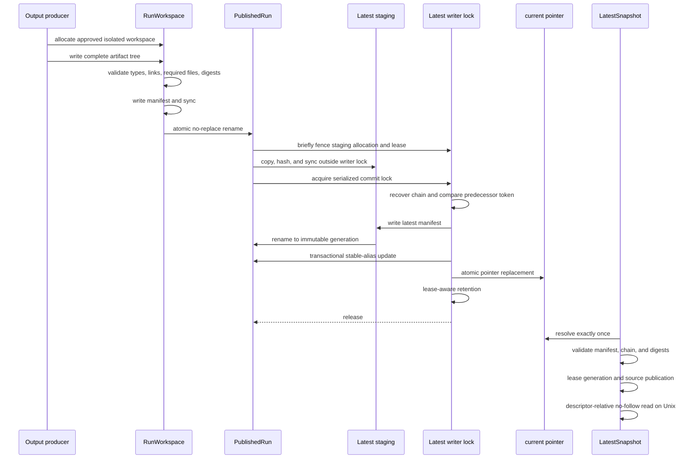
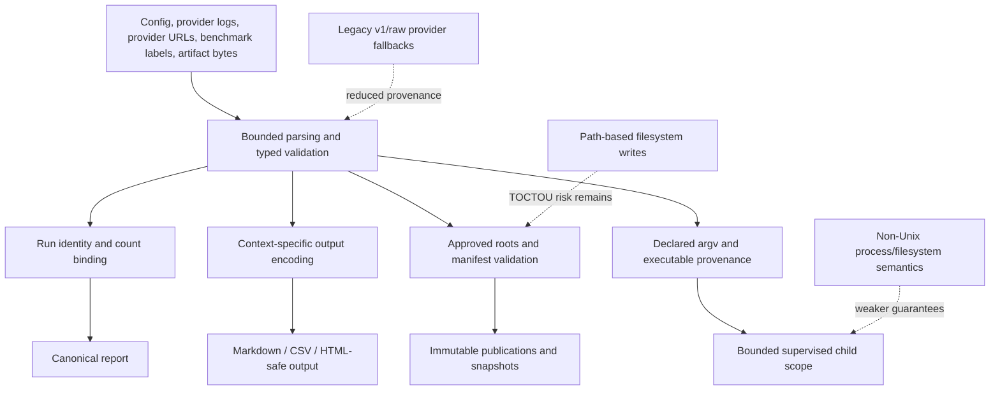

# Mobench 0.2 rewrite: architecture and implementation status

Updated: 2026-07-16. Compatibility oracle: `mobench` 0.1.43 at
`d1a3176f9144f35e777e83fd07045116144da257`.
Latest on-device BrowserStack implementation receipt: `d924678`. Latest
published evidence documentation: `5d77688`.

This document is the technical write-up for the 0.2 rewrite branch. It covers
the audit-driven foundations implemented in Phases 1-3, the behavior they
replace or harden, the compatibility boundary, the BrowserStack validation
matrix, and the work that remains before a 0.2 release.

The workspace version intentionally remains `0.1.43` while compatibility is
being characterized. The branch is an integration branch, not a finished 0.2
release.

## Executive summary

The rewrite is following a strangler pattern. It keeps the released CLI, SDK,
macro, runner, and artifact contracts working while extracting six narrow
foundation crates from the existing CLI and SDK:

- `mobench-runtime` owns bounded execution counts, distribution policies, and
  overflow-safe resource aggregation.
- `mobench-domain` owns bounded mobile framing and the strict versioned run
  report envelope.
- `mobench-report` owns output-context encoders for Markdown, links, inline
  code, and CSV.
- `mobench-process` owns executable provenance, subprocess policy, bounded
  capture, cancellation, timeout, tree cleanup, and reaping.
- `mobench-artifacts` owns validated output roots, isolated run workspaces,
  immutable publications, manifests, latest generations, recovery, leases,
  and retention.
- `mobench-provider` owns provider-independent session reconciliation,
  ambiguity rejection, deterministic receipts, and complete/partial/failed
  matrix outcomes.

The current branch changes 89 files relative to the release oracle. The main
improvements are:

1. Explicit compatibility receipts for public Rust, CLI, template, schema,
   performance, and output behavior.
2. A strict `mobench.run/v2` identity model and bounded Android frame decoder.
3. One overflow-safe statistics implementation shared by CLI and SDK while
   preserving their deliberately different released percentile policies.
4. Context-aware output encoding and formula-safe CSV rendering.
5. Complete BrowserStack session-set validation rather than partial-result
   acceptance.
6. A single supervised subprocess boundary for all production commands.
7. Transactional, manifest-backed artifact publication with immutable latest
   snapshots, crash recovery, and bounded retention.
8. Isolated profile runs and diffs instead of deterministic shared write
   directories.
9. Provider-independent matrix reconciliation extracted from BrowserStack,
   preserving current CLI failure semantics while making outcome state typed.

The most important remaining architectural work is to wire the strict v2
identity through generated runners and provider ingestion, split the very large
orchestration/provider/profile modules, complete the provider Seam with a
shared execution Interface and Local Adapter, and
finish descriptor-relative filesystem operations on every supported platform.

## Architecture at the current rewrite boundary

Dependency direction is intentionally inward. The domain, statistics,
encoding, process, and artifact foundations do not depend on HTTP clients,
mobile SDK builders, CLI parsing, or GitHub Actions. `mobench-sdk` only pulls in
process supervision when its `builders` feature is active; `runner-only`
remains a lightweight mobile timing configuration.

### Foundation crate responsibilities

| Crate | Owns | Does not own |
|---|---|---|
| `mobench-runtime` | Count bounds, distributions, released statistic policies, resource totals/maxima | CLI parsing, provider data, rendering |
| `mobench-domain` | Versioned report identity/outcome, request validation, bounded Android framing | BrowserStack HTTP, generated runner transport |
| `mobench-report` | Markdown, inline-code, link-destination, table-cell, and CSV field encoding | Report semantics or filesystem writes |
| `mobench-process` | Program provenance, argv/env/cwd/stdin/output policies, capture, timeout, cancel, cleanup, reap | Command selection or machine-output parsing |
| `mobench-artifacts` | Approved roots, run/latest manifests, staging, publication, snapshots, recovery, retention | Report contents or provider orchestration |
| `mobench-provider` | Expected/collected session reconciliation, structural ambiguity rejection, deterministic session receipts, matrix outcomes | HTTP, credentials, scheduling, polling, report parsing, rendering |
| `mobench-sdk` | Benchmark authoring, registry, timing, generated runners, mobile builders, FFI backends | Provider accounts, CI reporting, artifact ownership |
| `mobench` | Command resolution, provider orchestration, profiles, reporting, compatibility adapters | Low-level timing and foundation policies |

## Compatibility strategy

The rewrite is not using undocumented behavior as a guess. Phase 1 captured the
released 0.1.43 surfaces as executable receipts:

- Public Rust exports and feature combinations are name-checked.
- The CLI help tree, cargo wrapper, parse failures, exit codes, stdout, and
  stderr are compared with the release oracle.
- Generated template mirrors are characterized, including known historical
  drift.
- Existing summary, CI, trace-event, Markdown, CSV, and artifact names remain
  explicit contracts.
- Host Criterion receipts characterize config parsing, report rendering,
  profile Markdown, and BrowserStack extraction.
- A finding map ties each audit issue to a phase and verification gate.

Intentional 0.2 breaks must be recorded instead of silently changing these
receipts. New internal types can be strict even while compatibility adapters
continue to accept released v1 payloads.

Today, the strict v2 model is implemented and exhaustively tested in
`mobench-domain`, but the generated runners and BrowserStack ingestion still
primarily use v1/generic JSON compatibility paths. Wiring v2 end to end is the
next major contract milestone.

## Functionality and reliability changes

### Versioned report identity

`mobench-domain` defines a success/failure envelope that binds all evidence to:

- schema version;
- run ID and nonce;
- requested benchmark function;
- provider and provider session;
- device identity;
- producer identity;
- requested iteration and warmup counts;
- observed iteration and warmup counts;
- samples or a structured failure outcome.

A report with missing identity, mismatched identity, unknown outcome, empty
successful samples, excessive observations, or inconsistent counts fails
closed. The legacy adapter is deliberately marked reduced-provenance and cannot
masquerade as a fully validated v2 report.

### Bounded mobile framing

Android START/CHUNK/END log framing now has one shared decoder. It rejects:

- a chunk or end marker before start;
- nested or interleaved frames;
- marker lines with trailing data;
- truncated frames;
- invalid JSON;
- payloads larger than 1 MiB.

The released one-line legacy frame remains available through an explicit
compatibility path.

### BrowserStack completion semantics

Provider completion is no longer inferred from “at least one result.” A run is
complete only when:

- the terminal session set is nonempty;
- expected device/session identities are unique;
- every expected session was collected;
- every collected session is expected;
- every required session passed;
- every passed session contains exactly one benchmark report;
- result-less and failed sessions retain diagnostic failure evidence.

This contract now lives in the provider-independent `mobench-provider` Module.
Its Interface accepts the expected terminal sessions and collected report
counts, then returns deterministic per-session receipts plus a typed
`Complete`, `Partial`, or `Failed` matrix outcome. Structural ambiguity—empty
expected matrices, duplicate sessions or devices, unexpected collected
sessions, or multiple reports attributed to one session—fails closed as a
typed error. BrowserStack is the first Adapter using the Module; the Local
Adapter and shared execution Interface remain Phase 4 work.

The Module passes the deletion test: removing it would re-spread duplicate,
missing, unexpected, status, and report-cardinality checks into every provider
Adapter. Its small Interface therefore adds leverage for future Adapters and
locality for the matrix contract. It is not yet the provider execution Seam;
one Adapter would make that Seam hypothetical, while the planned BrowserStack
and Local Adapters will make it real.

Authenticated artifact downloads attach BrowserStack credentials only to HTTPS
URLs on `browserstack.com` or its subdomains. Provider-supplied URLs outside
that trust boundary are fetched without credentials or rejected by the calling
path.

### Shared execution counts and statistics

`MAX_BENCHMARK_COUNT` is one million. The same bound is applied at config/CLI
parsing, SDK construction and deserialization, runtime execution, and strict
report validation.

`Distribution` centralizes two intentionally different v1 contracts:

- CLI summaries use integer-floor mean and nearest-rank p95.
- SDK reports use floating mean/median, sample standard deviation, and the
  released rounded-index percentile behavior.

Both use `u128` intermediate accumulation. Public fixed-width outputs saturate
instead of wrapping. Owned samples are sorted once; borrowed samples allocate
and sort only if an order statistic is requested. `ResourceAccumulator`
applies the same policy to CPU totals/medians and memory maxima in SDK reports,
BrowserStack normalization, split-run merging, and summaries.

### Subprocess supervision

All production subprocess sites now declare a `ProcessSpec` and execute through
`mobench-process`. Direct `std::process::Command` remains only inside the runner
implementation and tests.

The runner provides:

- explicit executable provenance;
- literal argv rather than shell concatenation;
- explicit cwd, environment, stdin, and output policies;
- 16 MiB per-stream CLI/SDK capture bounds;
- head, tail, and head-and-tail retention;
- concurrent stream draining without deadlock;
- drain quanta so a hot stream cannot starve deadline checks;
- process-group termination;
- cooperative cancellation;
- wait-before-reap lifecycle to keep the process-group identity pinned;
- bounded cleanup of descendants that retain inherited pipes;
- kill-and-reap on error paths;
- machine-output completeness enforcement.

The CLI installs one Ctrl-C handler. The first signal requests cooperative
cancellation of active managed process scopes; a second signal exits with 130.

The iOS builder also carries benchmark completion timeout explicitly. The
legacy environment variable remains only as a compatibility fallback, removing
the need for CLI code to mutate process-global environment during a run.

### Artifact ownership and publication

Profile runs and profile diffs no longer write into one deterministic shared
directory. Every producer gets a unique run workspace and publication ID.

Publication guarantees include:

- validated one-component artifact IDs and approved output roots;
- unique staging and immutable publication directories;
- workspace leases and crash quarantine;
- recursive rejection of symlinks and non-regular files;
- Unix hardlink rejection for publication-private artifacts;
- deterministic SHA-256 manifests;
- file and directory sync before visibility changes;
- atomic no-replace publication rename on macOS/iOS, Linux/Android, and
  Windows;
- a compare-and-swap latest token captured when the run was allocated;
- immutable latest generations linked by predecessor identity;
- one atomic `current` pointer replacement;
- pinned snapshot readers that never mix generations;
- transactional compatibility aliases, including removal of aliases omitted by
  the next generation;
- rollback before pointer commit and explicit durability uncertainty after a
  commit boundary;
- recovery of a unique valid chain tip while rejecting forks, cycles,
  downgrades, unknown manifest versions, corrupt digests, and broken history;
- reader leases that defer deletion while a generation or source run is active.

Retention is bounded to eight latest generations, 32 published runs, and 16
entries per quarantine. A validated retention-boundary record distinguishes an
intentionally pruned predecessor from an unexpectedly broken chain.

Large latest copies, hashing, and syncing happen before the serialized writer
lock. The active staging generation holds an exclusive lease, so another
writer's recovery pass cannot quarantine it. Allocation and initial lease
acquisition are briefly lock-fenced to eliminate the pre-lease race.

### Output safety

`mobench-report` uses field-context encoders instead of one generic escape
function:

- Markdown inline text neutralizes markup, raw HTML, and line breaks.
- Table cells cannot terminate the row or create active links.
- Inline code contains arbitrary backticks without changing structure.
- Link destinations percent-encode syntax-changing bytes.
- CSV follows RFC 4180 quoting and neutralizes spreadsheet formula prefixes,
  including whitespace/control-character bypasses.

The flamegraph viewer parses SVG through an allowlist sanitizer before placing
it in same-origin `srcdoc`. Active elements/attributes and ambiguous markup are
rejected; Mobench's trusted zoom runtime is reintroduced after sanitization.

Plot rendering validates the output root and rejects symlinked plot
directories before invoking the pinned Python executable policy.

## Performance changes

The implemented changes target bounded overhead and shorter contention paths:

- statistics reuse one sorted owned sample set;
- mean-only borrowed operations avoid sorting and allocation;
- arithmetic uses safe fixed-width conversion rather than retry/fallback paths;
- process output memory is bounded per stream;
- stream drain quanta preserve timeout and cancellation responsiveness;
- files are hashed in 64 KiB streaming chunks;
- latest generation copy/hash/sync is outside the global writer lock;
- retained disk state is bounded and lease-aware;
- one persistent memory sampler is reused across iterations instead of
  spawning one worker per sample;
- profile publications do not repeatedly inherit or recopy stale run trees.

Criterion receipts currently characterize host configuration parsing, summary
Markdown/CSV, profile Markdown, and BrowserStack extraction. They are a
regression baseline, not yet proof of the final 0.2 targets for large reports,
paired mobile timing overhead, symbolization caching, or provider throughput.

## Security model and remaining trust boundaries

Closed or materially reduced risks include count amplification, arithmetic
overflow, partial BrowserStack success, malformed Android framing, credential
forwarding to arbitrary asset hosts, CSV formula injection, Markdown/HTML
injection, unsafe flamegraph SVG, unbounded child output, orphaned process
groups on Unix, shared profile write directories, stale latest artifacts, and
unbounded artifact retention.

The following are still explicit residual risks:

1. Strict v2 identity is not yet carried end to end by generated runners and
   BrowserStack ingestion.
2. Legacy standalone JSON and marker fallbacks have reduced provenance and are
   not nonce/session authenticated.
3. Most filesystem writes and several manifest/hash reads remain path-based
   check-then-open operations. Unix latest-snapshot artifact reads are already
   descriptor-relative with `openat(..., O_NOFOLLOW)`; broader capability-based
   writes remain planned.
4. Non-Unix process-tree guarantees are deliberately reported as unsupported.
   Windows artifact rename code cross-compiles and uses write-through
   no-replace/replace operations, but directory fsync, hardlink rejection, and
   descriptor-relative reads are weaker than Unix.
5. The current major modules remain too concentrated: `mobench/src/lib.rs`,
   `profile.rs`, `browserstack.rs`, and `mobench-artifacts/src/lib.rs` still
   require decomposition.

## BrowserStack validation plan

The repository's GitHub Actions path is the supported way to test the rewrite.
It requires the `BROWSERSTACK_USERNAME` and `BROWSERSTACK_ACCESS_KEY` repository
secrets. The legacy `test_browserstack.sh` must not be used because it parses a
local environment file unsafely, assumes obsolete artifact paths, and bypasses
the rewritten orchestration.

### Fixtures and backends

| Fixture | Functions | Backends | Initial coverage |
|---|---|---|---|
| `examples/ffi-benchmark` | `bench_fibonacci`, `bench_checksum` | UniFFI, native C ABI, BoltFFI | Primary workflow fixture |
| `examples/basic-benchmark` | `bench_fibonacci`, `bench_checksum` | UniFFI, native C ABI | Explicit workflow inputs |
| `crates/sample-fns` | `fibonacci`, `checksum` | Legacy runner plus UniFFI/BoltFFI bridge | Self-test workflow |

### Progressive service-gated matrix

1. FFI fixture, UniFFI, Android Pixel 7 / Android 13, Fibonacci, three
   iterations and one warmup.
2. FFI fixture, UniFFI, iPhone 14 / iOS 16, Fibonacci, `3/1`.
3. Basic fixture, native C ABI, Android then iOS, Fibonacci, `3/1`.
4. Basic fixture, UniFFI, Android then iOS.
5. FFI fixture, BoltFFI, Android then iOS.
6. Self-test fixture on Android then iOS.
7. Full FFI fixture: both functions, both platforms, five iterations and one
   warmup.
8. Statistically meaningful sample counts only after every smoke lane is
   reliable.

Each platform/function pair creates a separate BrowserStack build. A
two-platform/two-function run therefore consumes four provider builds. Every
gate must inspect platform jobs and downloaded `failure.json`/`failure.md`
evidence; a green summary job alone is not proof of a green benchmark run.

The first dispatch should use the exact pushed commit SHA and the checked-out
workflow's `head_sha` input. This ensures builders, CLI, generated runners, and
provider orchestration all come from the same tested revision.

### BrowserStack validation receipts

The first service-gated runs exercised the generated Android and iOS projects,
instrumentation/XCUITest harnesses, BrowserStack collection, and wrapper
aggregation. Results were checked at the platform-job level, including the
emitted benchmark payload and downloaded failure artifacts; the wrapper job was
treated only as an orchestration receipt.

| GitHub Actions run | Platform and path | Result | Platform-level evidence |
|---|---|---|---|
| [29478535017](https://github.com/worldcoin/mobile-bench-rs/actions/runs/29478535017) | Android, FFI fixture, UniFFI | Failed after benchmark execution | The device emitted valid `BENCH_JSON`, but the Kotlin instrumentation assertion interpreted success using the inherited Android activity result code rather than Mobench's result contract. This proved the runner executed and isolated the failure to the test-harness boundary. |
| [29479391615](https://github.com/worldcoin/mobile-bench-rs/actions/runs/29479391615) | Pixel 7 / Android 13, FFI fixture, UniFFI, `ffi_benchmark::bench_fibonacci`, `3/1` | Passed | BrowserStack session `263283d0f7c73f7886ede70ca1b703e37654d897`; three samples and resource metrics were collected, instrumentation reported `OK (1 test)`, and no failure files were produced. |
| [29480094162](https://github.com/worldcoin/mobile-bench-rs/actions/runs/29480094162) | iPhone 14 / iOS 16, FFI fixture, UniFFI, `ffi_benchmark::bench_fibonacci`, `3/1` | Passed | BrowserStack session `8e078f3838aedd4772b61ca15c8d4ce2bb53e317`; XCUITest passed, three samples and resource metrics were collected, and no failure files were produced. |
| [29480775237](https://github.com/worldcoin/mobile-bench-rs/actions/runs/29480775237) | Android and iOS, basic fixture, native C ABI | iOS passed; Android failed while compiling the test APK | The iOS platform job passed in session `d01e4f9f62db6b6161497e65bbccce52d816ab05`. Android never reached BrowserStack execution because the shared instrumentation test referenced lifecycle/watchdog methods that the native activity did not expose. |
| [29481516576](https://github.com/worldcoin/mobile-bench-rs/actions/runs/29481516576) | Pixel 7 / Android 13, basic fixture, native C ABI, `basic_benchmark::bench_fibonacci`, `3/1` | Passed, including wrapper aggregation | BrowserStack session `d2bc6754ed68ab883013d35e40a03ee0d7a864c1`; the platform job collected three samples and resource data, instrumentation reported `OK (1 test)`, no failure files were produced, and the downstream aggregation job completed successfully. |
| [29482438739](https://github.com/worldcoin/mobile-bench-rs/actions/runs/29482438739) | Pixel 7 / Android 13 and iPhone 14 / iOS 16, basic fixture, UniFFI, `basic_benchmark::bench_fibonacci`, `3/1` | Both platforms and aggregation passed | Android session `8f378d4260825ce39ddaa8693469fa08032ee678` and iOS session `f1286105f2cdcd5e0a69c8a8522a6278c1da07f6` each passed one platform test with exactly three samples and resource metrics; no failure/error/crash files were produced. |
| [29483163411](https://github.com/worldcoin/mobile-bench-rs/actions/runs/29483163411) | Pixel 7 / Android 13 and iPhone 14 / iOS 16, FFI fixture, BoltFFI, `ffi_benchmark::bench_fibonacci`, `3/1` | Both platforms and aggregation passed | Android session `1b699f5fc1b431ca8f1727c37d7383a47eb3a141` and iOS session `7064031020bcedd12dad98bf6a4e10ea7072f6e6` each passed one platform test with exactly three samples; no failure/error/crash files were produced. This directly validates the BoltFFI lifecycle fix. |
| [29486506027](https://github.com/worldcoin/mobile-bench-rs/actions/runs/29486506027) | Dedicated `sample-fns` self-test, both platforms, `sample_fns::fibonacci`, requested `3/1` | Both platforms failed provider preflight; no sessions created | The built-in `low-spec` profile resolved to catalog entries BrowserStack no longer offered: `iPhone SE 2020-16` and `Motorola Moto G9 Play-10.0`. No benchmark executed and no result artifacts existed, so the failure is not counted as a device receipt. |
| [29486920400](https://github.com/worldcoin/mobile-bench-rs/actions/runs/29486920400) | Dedicated `sample-fns` self-test, Pixel 7 / Android 13 and iPhone 14 / iOS 16, `sample_fns::fibonacci`, `3/1` | Android passed; iOS emitted the requested report but XCUITest failed | Android session `1141205f709e458019940cbb080fb387904a7255` passed with three samples. iOS session `002063f97b4ce45edf17fc117637850db3e38ca8` emitted a valid three-sample Fibonacci report, but the regenerated test still asserted the stale scaffolding default `sample_fns::example_benchmark`. |
| [29487765240](https://github.com/worldcoin/mobile-bench-rs/actions/runs/29487765240) | Dedicated `sample-fns` self-test at `d924678`, Pixel 7 / Android 13, `sample_fns::fibonacci`, `3/1` | Android passed; manually supplied iOS selector was rejected before session creation | Android session `eef9625a8ed8984a2bbd6de8b9c925ed32847ad8` passed with exactly three samples and resource metrics. The `iPhone 14-16.5` input was rejected because the catalog accepts the selector `iPhone 14-16`; this was an operator-input failure and produced no iOS session or artifact. |
| [29488058734](https://github.com/worldcoin/mobile-bench-rs/actions/runs/29488058734) | Dedicated `sample-fns` self-test at `d924678`, iPhone 14 / iOS 16, `sample_fns::fibonacci`, `3/1` | iOS and aggregation passed | XCUITest session `7cf50d393a50d6eb2c52b8f34cba14f79b825416` passed with the requested function, exactly three samples, resource metrics, zero failed/error/crash testcases, and no failure/error/crash artifact files. This is the on-device receipt for rebinding regenerated XCUITest source to the active request. |
| [29488499207](https://github.com/worldcoin/mobile-bench-rs/actions/runs/29488499207) | FFI fixture, UniFFI, Pixel 7 / Android 13 and iPhone 14 / iOS 16, Fibonacci plus checksum, `5/1` | Both platforms and aggregation passed | Four BrowserStack sessions passed: Android Fibonacci `8b71f401d617bb27a8e9e7c90285c39f27de0e90`, Android checksum `4c5dfd84da1288f82a41aa6e0e8dbdb50f646c1b`, iOS Fibonacci `58474b669a6ebf5503d71b4ad7ff796c463a7159`, and iOS checksum `955a8a112cd5074de14f3618f9761b8424cd0515`. Every report has the requested identity and `5/1` counts, exactly five samples, resource metrics, zero failed/error/crash testcases, and no failure/error/crash artifact files. The wrapper aggregation also completed successfully. |

The staged matrix exposed three distinct generated-runner and workflow drift
classes rather than benchmark-algorithm failures:

- Commit `33fda9b` fixed Android UniFFI result handling. Kotlin's inherited
  `Activity.RESULT_OK` is `-1`, while Mobench's benchmark success code is `1`;
  the generated harness now uses the Mobench lifecycle result contract
  unambiguously. Run 29479391615 is the green receipt for that fix.
- Commit `ff7a3f9` aligned the native C ABI and BoltFFI Android activities with
  the lifecycle and watchdog interface used by the shared instrumentation
  harness. Run 29481516576 proves the native Android compile-and-run path after
  that change, and run 29483163411 independently proves BoltFFI on both
  platforms.
- Run 29486506027 exposed a different kind of drift: the self-test depended on
  static built-in `low-spec` catalog entries. The workflow now exposes explicit
  Android/iOS device and OS inputs with known-good defaults, while dynamic
  catalog-backed profile resolution remains part of the provider-seam rewrite.
- Run 29486920400 exposed request/spec drift after iOS project regeneration:
  the benchmark app ran the requested function, but the generated XCUITest
  retained the crate's default function. Commit `d924678` re-embeds the active
  `RunSpec` after the builder refreshes generated sources and fails closed if
  the expected test binding is missing or duplicated. Run 29488058734 is the
  green on-device regression receipt.

These receipts validate the FFI and basic UniFFI paths, native C ABI, BoltFFI,
the dedicated self-test, and the two-function `5/1` lane on both platforms. A
successful wrapper aggregation still means only that expected platform
artifacts were processed; the authoritative device result remains the platform
job plus its BrowserStack session and downloaded evidence.

#### Evidence interpretation and limitations

The downloaded receipts are internally consistent: each smoke lane has one
passing provider session, one passing platform test, the requested `3/1`
counts, exactly three benchmark samples, and zero reported crashes. The final
matrix has four passing sessions with the requested `5/1` counts and exactly
five samples per platform/function pair. `bench-report.json`, `summary.json`,
and `results.csv` agree. No credential, authorization header, private key,
password, or email was present in the downloaded artifacts.

They are functional and contract receipts, not stable cross-device performance
baselines. BrowserStack app profiling was enabled, the requested iOS 16 selector
resolved to iOS 16.5 for UniFFI and 16.4 for native, and provider telemetry uses
its own sample count independently of benchmark iterations. Native reports also
carry a timeline while current UniFFI reports leave phases empty, and Android
UniFFI's raw statistics are narrower than the aggregation statistics. The v2
normalization phase must either eliminate or explicitly version these schema
differences.

Raw provider logs are retained as private diagnostics because they contain
session/build IDs, device identifiers, commit SHAs, commands, process metadata,
and measurements even though they contain no observed secrets. Current noise
includes non-fatal Android `dumpGfxInfo()`/SELinux messages and post-test iOS
LLVM profile-write errors; receipt extraction should classify or filter these
without hiding real harness failures.

## Remaining rewrite phases

The foundation work makes the larger rewrite safer; it does not eliminate the
remaining phases:

1. **Provider identity wiring:** emit and validate the canonical v2 envelope in
   generated Android/iOS runners, local adapters, and BrowserStack collection.
2. **Provider Seam:** session reconciliation is now provider-independent.
   Define one execution Adapter Interface, add a real Local Adapter, and move
   BrowserStack orchestration behind the same Seam so the two are peers rather
   than branches embedded in orchestration. Bind every collected report and
   failure to its expected session identity and add cancellation, retry, and
   state-transition tests.
3. **Run state machine:** replace scattered boolean/status decisions with one
   explicit lifecycle from resolution through publication.
4. **Canonical report pipeline:** make JSON, Markdown, CSV, plots, GitHub
   comments, checks, comparisons, and profile summaries adapters over one
   canonical report.
5. **CLI decomposition:** move resolution, build, run, fetch, summarize,
   compare, report, and profile commands out of the 11k-line facade.
6. **Profile decomposition and symbolization cache:** separate planning,
   capture, normalization, symbolization, flamegraph generation, and diffing.
7. **Capability-based filesystem operations:** extend descriptor-relative,
   no-follow operations across writes, manifests, hashing, aliases, recovery,
   and supported non-Unix implementations.
8. **Workflow and example matrix:** make every supported fixture/backend pair a
   repeatable service-gated test with preserved provider evidence.
9. **Deletion pass:** remove legacy orchestration paths only after the
   compatibility suite and BrowserStack matrix prove their replacements.
10. **0.2 release hardening:** versioning, migration notes, publish dry-runs,
    reproducible performance receipts, and final docs.

## Verification receipts for Phases 1-4

The integration branch is gated with:

- `cargo fmt --all -- --check`;
- `cargo clippy --workspace --locked --all-targets --all-features -- -D warnings`;
- `cargo test --workspace --locked`;
- `RUSTDOCFLAGS="-D warnings" cargo doc --workspace --locked --all-features --no-deps`;
- `cargo deny check advisories bans licenses sources`;
- `cargo test -p mobench-sdk --locked --no-default-features --features runner-only`;
- Windows cross-check for `mobench-artifacts` on
  `x86_64-pc-windows-gnu`;
- Python plot-layout unit tests;
- host Criterion contract smoke;
- v0.1.43 CLI, public API, template, schema, and artifact compatibility
  fixtures.

Live Dependabot state identified two lockfile advisories that the local advisory
database had not yet reported: high-severity `GHSA-6xvm-j4wr-6v98` in
`quinn-proto` 0.11.13 and low-severity `GHSA-cq8v-f236-94qc` in `rand` 0.9.2.
The lockfile now uses the first patched releases, `quinn-proto` 0.11.14 and
`rand` 0.9.3. The former was an unused stale lock entry; the latter is reached
through test-only `proptest`. The full workspace suite, all-feature clippy, and
all `cargo deny` gates pass after the targeted updates.

BrowserStack receipts are linked above and in the rewrite plan. They validate
the current compatibility paths, but the provider-identity phase remains open
until generated runners and ingestion exchange the strict v2 envelope end to
end.

The first Phase 4 slice adds `mobench-provider` and migrates BrowserStack's
completion classifier to it without changing the CLI's incomplete/ambiguous
failure categories. Unit coverage includes complete matrices of 1, 10, and 50
devices; deterministic expected-order receipts; partial and total failure;
missing, non-passed, and result-less sessions; and every duplicate/unexpected
ambiguity class. The focused provider and BrowserStack compatibility tests pass.
The full workspace test suite, all-target/all-feature clippy with warnings
denied, and cargo-deny advisories/bans/licenses/sources gate also pass for this
slice.
