# Reusable Workflow Security

Current release: **0.1.44**.

The reusable BrowserStack workflow is secure by default for pull requests,
including fork pull requests. Its core invariant is:

> Pull-request-controlled code never executes in a job that has BrowserStack
> credentials or write-capable repository credentials.

An authorized maintainer's `/mobench` comment authorizes a run. It does not make
the pull request's commit, dependencies, build scripts, hooks, fixtures, or
benchmark binaries trusted.

## Two-Stage Architecture

The workflow separates code construction from provider access:

1. `validate-request` accepts only a 40-character commit SHA and confirms it is
   still the current head SHA of the requested pull request.
2. `prepare-android` and `prepare-ios` check out that exact SHA, generate
   fixtures, compile/package the mobile runners, and upload a run-scoped handoff.
3. `run-android` and `run-ios` download and verify the handoff,
   upload the prebuilt artifacts, run them on BrowserStack devices, and fetch
   results. They do not check out the pull request.
4. `summarize` combines read-only result artifacts.
5. `report` publishes the sticky PR comment or check result without checking
   out or executing pull-request code.
6. Plot-branch publication is a separate manual workflow,
   `mobile-bench-publish-plots.yml`. It is the only workflow allowed to request
   `contents: write` and is isolated behind the `mobench-plots` environment.

```mermaid
flowchart LR
    request["PR number + exact head SHA"]
    validate["validate-pr-head\nread only"]
    prepare["prepare Android/iOS\nuntrusted code, no secrets"]
    handoff["enumerated artifacts\n+ manifest"]
    provider["BrowserStack jobs\nsecrets, no caller checkout"]
    device["BrowserStack devices\nmobile code executes here"]
    results["untrusted result artifacts"]
    summarize["summarize\nread only"]
    report["report\nPR/check write only"]

    request --> validate --> prepare --> handoff --> provider --> device
    device --> results --> summarize --> report
```



## Job Permissions And Secrets

The workflow-level permission set is empty. Each job receives only its required
permission:

| Job | Caller checkout or execution | GitHub permission | BrowserStack secrets | Protected environment |
| --- | --- | --- | --- | --- |
| `validate-request` | No | `contents: read`, `pull-requests: read` | No | No |
| `prepare-android`, `prepare-ios` | Exact PR head; untrusted | `contents: read` | No | No |
| `run-android`, `run-ios` | No | `actions: read`, `pull-requests: read` | Upload/run/fetch step only | `browserstack` defense in depth |
| `summarize` | No | `actions: read` | No | No |
| `report` | No | `pull-requests: write` and/or `checks: write` | No | No |
| separate plot workflow | No | `actions: read`, `contents: write` | No | Protected manual opt-in |

BrowserStack values must be passed by name. `secrets: inherit` is not supported
as a safe caller pattern. Environment approval can limit accidental execution,
but artifact verification and the no-caller-execution rule are the primary
security boundary.

## Untrusted Prepare Phase

The prepare jobs deliberately allow the pull request to run Rust build scripts,
dependencies, fixture generators, Gradle/Xcode builds, hooks, and benchmark
code needed to produce the mobile packages. Those processes receive no
BrowserStack variables, no protected environment, and no write-capable GitHub
token.

Prepare uses:

```bash
cargo mobench ci prepare \
  --target android \
  --source-sha "$PR_HEAD_SHA" \
  --output-dir target/mobench/prebuilt/android \
  --manifest target/mobench/prebuilt/android/manifest.json
```

Use the corresponding `--target ios` invocation for the IPA and XCUITest suite.
The workflow uploads only the artifact roles explicitly allowed for that
platform and the generated manifest. It does not upload a caller workspace,
arbitrary glob, build cache, or executable helper for later runner execution.

Caches used by pull-request preparation are either disabled or scoped so they
cannot become a trusted build input. Trusted jobs do not restore build outputs
created by untrusted revisions.

## Artifact Manifest Boundary

The machine-readable manifest identifies every allowed file with:

- normalized relative path;
- artifact role and platform;
- exact byte size;
- lowercase SHA-256 digest;
- benchmark ABI name/version and compatibility metadata.

Before credentials are exposed, `run-prebuilt` rejects:

- absolute paths, `..` traversal, links, duplicate paths, and paths outside the
  downloaded artifact root;
- missing files, extra platform payloads, unexpected artifact roles, and
  invalid manifest or ABI versions;
- empty, oversized, or size-mismatched files;
- malformed or mismatched SHA-256 hashes.

The trusted phase then uses only the verified APK and Android test APK, or the
verified IPA and XCUITest package. Those mobile artifacts are uploaded as
opaque bytes; they are never launched, imported, sourced, unpacked for
execution, or otherwise run on the credentialed GitHub runner.

## Credentialed Prebuilt Phase

The trusted release is pinned to an immutable commit SHA. The credentialed jobs
may run only that trusted mobench binary and fixed workflow commands:

```bash
cargo mobench ci run-prebuilt \
  --manifest prebuilt/android-manifest.json \
  --expected-source-sha "$PR_HEAD_SHA" \
  --devices "Google Pixel 7-13.0" \
  --output-dir target/mobench/ci/android
```

`run-prebuilt` verifies the manifest and performs BrowserStack upload, session
creation, polling, fetch, and output normalization. It never invokes Cargo,
Gradle, Xcode, caller hooks, dependencies, fixture generators, benchmark
binaries, or other files from a caller checkout on the GitHub runner.

## Reporting Boundary

BrowserStack responses and downloaded JSON, CSV, Markdown, filenames, device
names, and benchmark names remain untrusted. The workflow and report commands:

- pass values as data rather than interpolating them into shell programs;
- reject unsafe paths and control characters;
- prevent GitHub workflow-command interpretation;
- escape untrusted Markdown/HTML content and preserve the sticky-comment marker;
- do not use report-provided filenames as upload, checkout, branch, or command
  paths.

The reporting job consumes only validated result artifacts. It never checks out
the pull request or executes a file from those artifacts.

## Caller Migration

Update the reusable workflow reference to the immutable commit for the `v0.1.44`
release and pass secrets explicitly:

```yaml
jobs:
  mobench:
    uses: worldcoin/mobile-bench-rs/.github/workflows/reusable-bench.yml@<v0.1.44-commit-sha>
    with:
      pr_number: ${{ github.event.pull_request.number }}
      head_sha: ${{ github.event.pull_request.head.sha }}
      crate_path: crates/benchmarks
      functions: '["benchmarks::critical_path"]'
      platform: both
    secrets:
      BROWSERSTACK_USERNAME: ${{ secrets.BROWSERSTACK_USERNAME }}
      BROWSERSTACK_ACCESS_KEY: ${{ secrets.BROWSERSTACK_ACCESS_KEY }}
```

Do not replace the immutable SHA with a mutable branch or tag and do not use
`secrets: inherit`. Existing function, iteration, warmup, platform, device,
artifact collection, summary, and sticky-comment inputs continue through the
secure split workflow; callers do not need to duplicate its internal jobs.

## Validation Expectations

Release validation includes:

- hostile fixture coverage in which `build.rs`, a fixture hook, a dependency,
  and benchmark code attempt to read BrowserStack variables and write through
  the GitHub token;
- static workflow tests proving credentialed jobs have no caller checkout or
  caller-controlled process execution;
- manifest path/hash/size/platform/ABI rejection tests;
- report-field escaping and workflow-command injection tests;
- `actionlint`, workspace workflow/self-tests, and one Android plus one iOS
  BrowserStack run through the prebuilt path.

The live Android and iOS BrowserStack runs are service-gated release checks and
must be reported separately from host-side or static validation.
